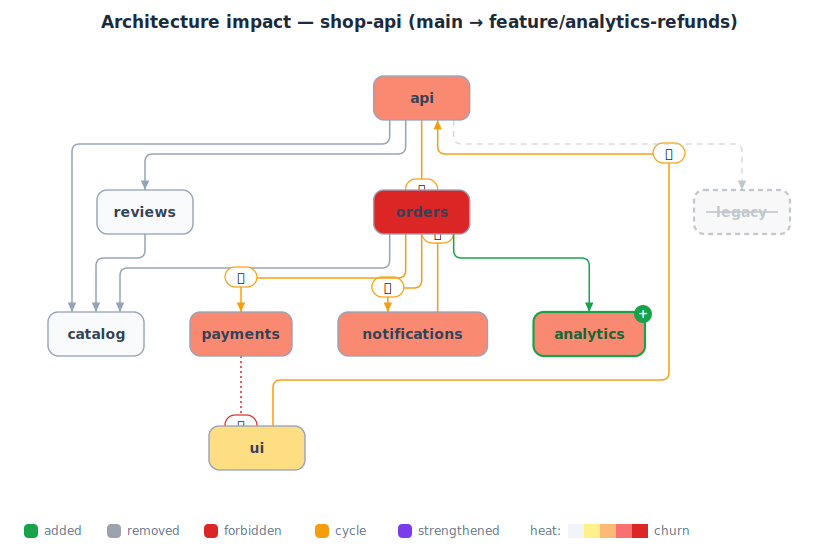

# 🩻 ArchXray

**See what a pull request does to your architecture — before you merge it.**

Every PR quietly reshapes your system's structure, and nobody notices until the
architecture diagram on the wiki is a work of fiction. ArchXray watches the
*module dependency graph* instead of the lines of code. When a PR changes the
structure, it posts one picture and one link:

- 🟢 **new modules and dependencies in green**
- ␡ **deleted ones struck out**
- 🚫 **forbidden dependencies called out by name** (from `archrules.json`)
- 🔄 **new dependency cycles detected automatically** — including transitive
  ones the author never saw
- 🔥 **heatmap of change** — the modules this PR churns glow
- 📈 **dependency strength** — edge thickness = import count, and edges that
  suddenly get much heavier are flagged
- 🎬 an **interactive report**: toggle heatmap / strength / only-changed,
  and *animate* the change — removed shrinks out, added grows in
- 🤖 an optional **AI one-paragraph read** of what the change *means*
- 🤫 **total silence when the architecture is untouched** — no bot spam



## Why it's different

| Typical tooling | ArchXray |
| --- | --- |
| Renders a diagram of *now* | Renders the **delta** — what *this PR* does |
| Diagram lives in a wiki, rots | Diagram is generated from the code, per PR |
| Lint rules print text walls | Violations are **drawn on the picture** |
| Layout shuffles every run | Layout is **precomputed with ELK — deterministic** |
| Static pictures | Static SVG in the comment, **interactive Cytoscape report** one click away |
| Reviews are frozen in time | `timelapse` replays your **architecture's whole evolution** |

Works on TypeScript/JavaScript and Python repos. No image hosting, no secrets —
the report and SVG are published to your repo's own `gh-pages` branch.

## Use it as a GitHub Action (one line)

```yaml
# .github/workflows/archxray.yml
name: ArchXray
on: pull_request
permissions:
  contents: write        # publish report to gh-pages
  pull-requests: write   # post the comment
jobs:
  xray:
    runs-on: ubuntu-latest
    steps:
      - uses: actions/checkout@v4
        with: { fetch-depth: 0 }
      - uses: MohammedRizwan4/arch-xray@main
        with:
          fail-on-violation: 'true'
```

Every PR that changes the architecture gets a comment with the diff image and a
link to the interactive report at `https://<owner>.github.io/<repo>/pr-<n>/report.html`.
Enable GitHub Pages (source: `gh-pages` branch) once and the links go live.

## Quickstart (60 seconds, local)

```bash
npm ci

# build the demo repo (a small shop API with git history + a spicy feature branch)
node demo/setup.js

# x-ray the "PR"
node bin/archxray.js diff --repo demo/shop-api --base main --head feature/analytics-refunds

# open archxray-out/report.html  ← the interactive report
```

```bash
# prove it stays quiet when only implementation changed
node bin/archxray.js diff --repo demo/shop-api --base main~2 --head main~1
#   architecture untouched — staying quiet.

# replay the architecture's history
node bin/archxray.js timelapse --repo demo/shop-api --count 10
```

## Use it on any repo

```bash
node bin/archxray.js diff --repo ../your-repo --base origin/main --head HEAD
node bin/archxray.js diff --repo ../your-repo --base main --head WORKTREE   # uncommitted changes
node bin/archxray.js diff --repo ../your-repo --base main --head HEAD --ai  # + Claude narration
```

Outputs in `archxray-out/`:

| file | what it is |
| --- | --- |
| `comment.md` | ready-to-post PR comment (`gh pr comment N --body-file archxray-out/comment.md`) |
| `report.html` | self-contained interactive report (Cytoscape.js inlined — works offline) |
| `diff.svg` | static diagram, drawn from the same ELK layout as the report |
| `diff.json` | machine-readable diff (for your own tooling) |

## Guardrails: `archrules.json`

Drop this in the repo root. Only *newly added* dependencies are judged —
pre-existing debt is baseline, not blame.

```json
{
  "forbid": [
    { "from": "payments", "to": "ui", "reason": "payment logic must stay UI-free" },
    { "from": "*", "to": "legacy", "reason": "legacy is frozen — no new callers" }
  ]
}
```

Add `--fail-on-violation` (CLI) or `fail-on-violation: 'true'` (action) to make
CI red when a rule breaks or a new cycle appears.

## How it works

1. `git archive` snapshots the base and head refs (no checkout, working tree untouched)
2. Imports are parsed (TS/JS `import`/`require`, Python `import`/`from`) and
   collapsed to a **module-level graph** — one node per top-level source folder,
   every edge carrying its **import count**
3. The two graphs are diffed: added/removed nodes and edges, plus edges whose
   import count jumps sharply (**strengthened**)
4. Added edges are checked against `archrules.json`; each added edge is also
   tested for closing a cycle (BFS back-path), so every reported cycle is
   provably *introduced by this PR*
5. **ELK** lays out the merged before∪after graph *once, in Node* — the same
   coordinates drive the static SVG and the interactive Cytoscape report, so
   layouts are deterministic and the comment image matches the report exactly
6. Heat per module = files changed + edges added + edges removed
7. Optionally, the diff summary is piped to `claude -p` for a 10-second human read

## POC limitations (deliberate)

- Module granularity = top-level folders under `src/` (or repo root); root-level files are ignored
- Import detection is regex-based (no tsconfig path aliases beyond `@/`, no barrel-file tracing)
- Rule patterns are exact names or `*` (no globs, no layer groups yet)
- The timelapse still renders via PlantUML (`--server` to self-host)

## Ideas that would take this further

- Coupling/instability score per PR ("this PR raises coupling by 12%")
- Blast-radius view: highlight every module transitively affected by the change
- `CODEOWNERS`-aware pings when *your* module gains a new inbound dependency
- Weekly "architecture drift" digest, and a badge for the README
